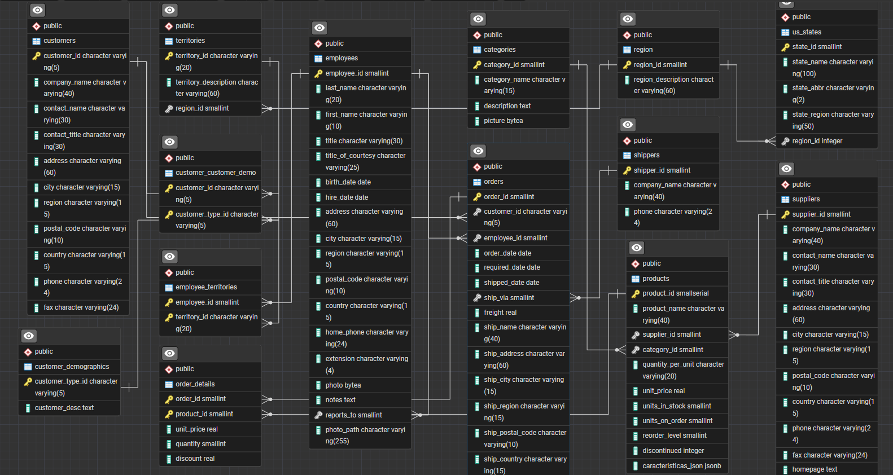
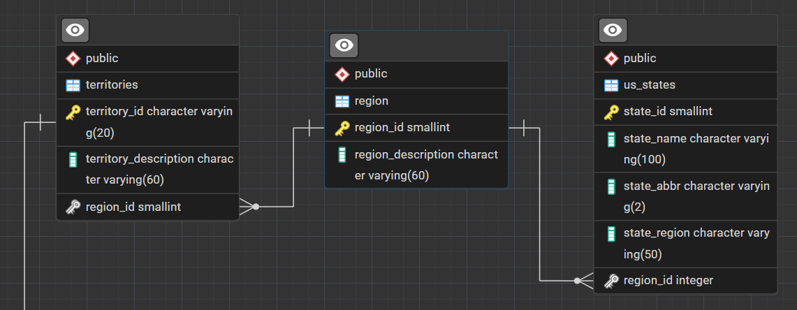

# NorthWind PostgreSQL - Versión Modificada

En este repositorio encontrarás una versión personalizada de la base de datos Northwind para PostgreSQL, que incorpora nuevas funcionalidades, vistas, triggers y un manejo avanzado de JSONB.
Las mejoras implementadas incluyen

- **Gestión de inventario**
- **Análisis de ventas por departamento**
- **Integración de datos dinámicos mediante JSONB**
- **Normalización y nuevas relaciones entre tablas**

---

## 📁 Estructura del Repositorio

```
NorthWind/
├── README.md
├── modificaciones_northwind.sql         # Script con todas las modificaciones y mejoras
├── NorthWind_views_exercises.sql        # Ejemplos de vistas avanzadas
├── productos_json.py                    # Script Python para actualizar la columna JSONB
├── productos.json                       # Datos de ejemplo para la columna JSONB
├── img/
│   ├── diagrama.png
│   ├── FK_us_states.png
│   └── json.png
└── northwind_dump/
    └── northwind_dump.sql               # Dump completo para importar en PostgreSQL
```

---


## 📋 Diagrama de la base de datos northwind

Northwind es una base de datos de ejemplo utilizada para practicar y demostrar conceptos de bases de datos y SQL. Simula el sistema de gestión de una empresa mayorista de productos alimenticios que vende a clientes minoristas y distribuidores. La base de datos contiene tablas relacionadas con clientes, proveedores, productos, pedidos, empleados y envíos, entre otros.




---

## 🛠️ Herramientas Utilizadas

- **PostgreSQL** 12+
- **pgAdmin** (opcional)
- **Python** (para el script de actualización JSON)
- **SQL Dump** para instalación rápida

---

## 🚀 Instalación Rápida

### Prerrequisitos

- PostgreSQL 12 o superior
- pgAdmin o cliente psql
- Python 3 (para el script opcional)

### Instalación

1. **Clona el repositorio**
   ```bash
   git clone https://github.com/BiaBib1/NorthWind.git
   cd NorthWind/northwind_dump
   ```

2. **Entra en la consola de PostgreSQL**
   ```bash
    psql -U postgres
   ```
3. **Crea la base de datos**
   ```bash 
   create database northwind
   ```

4. **Salir de PostgreSQL**
   ```bash 
   quit
   ```

5. **Importa el dump**
   ```bash
   psql -U postgres -d northwind -f northwind_dump.sql
   ```

O bien, usando pgAdmin: crea la base de datos `northwind` y usa "Restore" seleccionando `northwind_dump.sql`.

---

## 🔍 Principales Modificaciones 

### 1. Vistas

Se ha imaginado una empresa que utiliza la base de datos Northwind, dividida en tres departamentos:
 ventas, almacén y contabilidad.
 Por lo tanto, se han creado dos vistas para cada departamento asì que se pueden realizar consultas específicas.
 Ademas se ha creado tambien un trigger para actualizar automáticamente la disponibilidad del inventario después de un pedido. */


- **Departamento Ventas**:  
  - `vw_sales_summary_by_customer`: resumen de pedidos y ventas por cliente.
  - `vw_top_selling_products`: productos más vendidos por cantidad.

- **Departamento Almacén**:  
  - `vw_inventory_status`: estado de stock, resalta productos bajo el mínimo.
  - `vw_pending_orders`: pedidos aún no enviados.

- **Departamento Contabilidad**:  
  - `vw_invoices_by_customer`: total de facturas por cliente.
  - `vw_employee_sales`: ventas por empleado.

### 2. Trigger de Actualización de Stock

- **Trigger** `trg_update_stock_after_order`  
  Actualiza automáticamente la cantidad en almacén de los productos tras cada nuevo pedido (`AFTER INSERT ON order_details`).

### 3. Relación entre `us_states` y `region`

- Añadida columna `region_id` a `us_states` y creada clave foránea hacia `region`.
- Normalización de los valores de región e inserción de la región "Midwest".



### 4. Columna JSONB en `products`

- Añadida la columna `caracteristicas_json` de tipo JSONB para almacenar atributos dinámicos de los productos (categoría, subcategoría, etc).
- Creación de un índice GIN para optimizar las consultas sobre esta columna.

---

## 📝 Descripción de `productos.json` y `productos_json.py`

### `productos.json`

Contiene un array de productos con sus respectivos atributos dinámicos (categoría y subcategoría), por ejemplo:
```json
{
  "product_id": 1,
  "caracteristicas": {
    "categoria": "Beverages",
    "subcategoria": "Tea"
  }
}
```
Estos datos están pensados para ser cargados en la columna `caracteristicas_json` de la tabla `products`.

### `productos_json.py`

Script Python que:
- Lee el archivo `productos.json`
- Se conecta a la base de datos PostgreSQL
- Actualiza la columna `caracteristicas_json` de la tabla `products` para cada producto, insertando los datos JSON correspondientes.

**Ejemplo de funcionamiento:**
```python
for product in data['products']:
    product_id = product['product_id']
    caracteristicas_json = json.dumps(product['caracteristicas'])
    cursor.execute("""
        UPDATE products
        SET caracteristicas_json = %s
        WHERE product_id = %s
    """, (caracteristicas_json, product_id))
```
Esto permite tener datos estructurados y fácilmente consultables mediante funciones y operadores JSONB de PostgreSQL.

**Ejemplo de query:**

---

## 📊 Ejemplos de Consultas y Vistas

- **Productos con stock bajo:**  
  ```sql
  SELECT * FROM vw_sales_summary_by_customer LIMIT 5;
  SELECT * FROM vw_inventory_status WHERE stock_status = 'LOW STOCK';
  SELECT caracteristicas_json FROM products WHERE caracteristicas_json IS NOT NULL LIMIT 5;
  ```
- **Ventas por categoría:**  
  Consulta el archivo `NorthWind_views_exercises.sql` para muchas otras vistas de análisis.

---

## 👨‍🎓 Información Académica

- **Curso**: Bases de Datos - Modulo UF1472
- **Autor**: Bianca Razzoli
- **Año**: 2025

---

**Nota**: El archivo `northwind_dump/northwind_dump.sql` contiene todas las modificaciones y debe ser importado para ver el resultado final en PostgreSQL/pgAdmin.